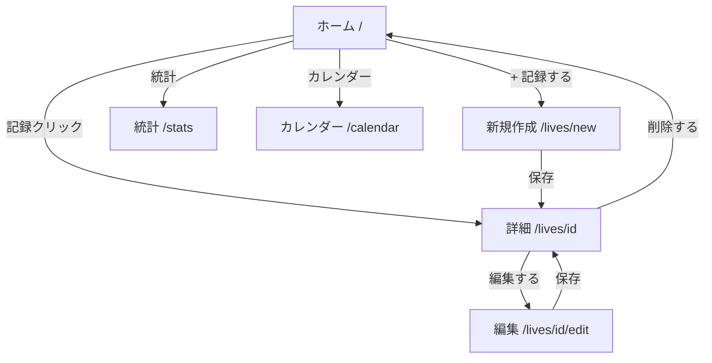

#AI #Claude #report

## 関連ファイル

- [[livekun-spec-summary]] - 現行仕様まとめ
- [[feature-proposals]] - 追加機能提案

## 報告

### 実施内容

| タスク | 状態 | 概要 |
|--------|------|------|
| 仕様まとめ | 完了 | 技術スタック、画面、データモデル、APIを文書化 |
| 機能調査 | 完了 | 11機能を優先度別に提案 |
| API連携 | 完了 | localStorage → バックエンドAPI呼び出しに変更 |
| 編集機能 | 完了 | `/lives/[id]/edit` ページを新規作成 |
| 検索機能 | 完了 | ホームページにリアルタイム検索を追加 |
| コンポーネント整理 | 完了 | ナビゲーション統合、ページ構造整理 |
| PWA対応 | 完了 | manifest.json、viewport設定 |
| 統計ダッシュボード | 完了 | `/stats` ページを新規作成 |
| カレンダー表示 | 完了 | `/calendar` ページを新規作成 |
| ユーザー認証 | 保留 | 外部サービス設定が必要 |
| S3対応 | 保留 | AWS認証情報が必要 |
| SNS共有 | 保留 | 認証機能前提 |
| セットリスト連携 | 保留 | 外部API連携が必要 |

### 変更ファイル一覧

#### フロントエンド

| ファイル | 変更種別 | 内容 |
|---------|---------|------|
| `src/types/live.ts` | 修正 | Photo型追加、CreateLiveInput型追加、id?をSetlistItem/NearbyFacilityに追加 |
| `src/lib/api.ts` | 新規 | バックエンドAPI呼び出しクライアント（CRUD + 写真アップロード） |
| `src/lib/storage.ts` | 削除 | localStorage操作（API連携により不要） |
| `src/app/layout.tsx` | 修正 | ナビゲーションに統計・カレンダーリンク追加、viewport設定 |
| `src/app/page.tsx` | 修正 | API連携、検索機能追加、ローディング表示 |
| `src/app/lives/new/page.tsx` | 修正 | API連携、写真はFileオブジェクトで管理 |
| `src/app/lives/[id]/page.tsx` | 修正 | API連携、編集ボタン追加、Photo型対応 |
| `src/app/lives/[id]/edit/page.tsx` | 新規 | 編集ページ（既存データの読み込み・更新） |
| `src/app/stats/page.tsx` | 新規 | 統計ダッシュボード（年別/月別/アーティスト別/会場別） |
| `src/app/calendar/page.tsx` | 新規 | カレンダービュー（月表示、日付にライブ表示） |
| `public/manifest.json` | 新規 | PWA マニフェストファイル |

#### バックエンド

| ファイル | 変更種別 | 内容 |
|---------|---------|------|
| `src/app.module.ts` | 修正 | ServeStaticModule追加（uploadsディレクトリの静的配信） |
| `package.json` | 修正 | @nestjs/serve-static追加 |

### 画面構成（更新後）

### 保留タスクの実装に必要な前提条件

| タスク | 前提条件 |
|--------|---------|
| ユーザー認証 | NextAuth.js設定、OAuth provider選定、DBにuserテーブル追加 |
| S3対応 | AWSアカウント設定、IAMロール、S3バケット作成、環境変数設定 |
| SNS共有 | 認証機能の実装、OGP画像生成サービスの選定 |
| セットリスト連携 | setlist.fm APIキーの取得 |
