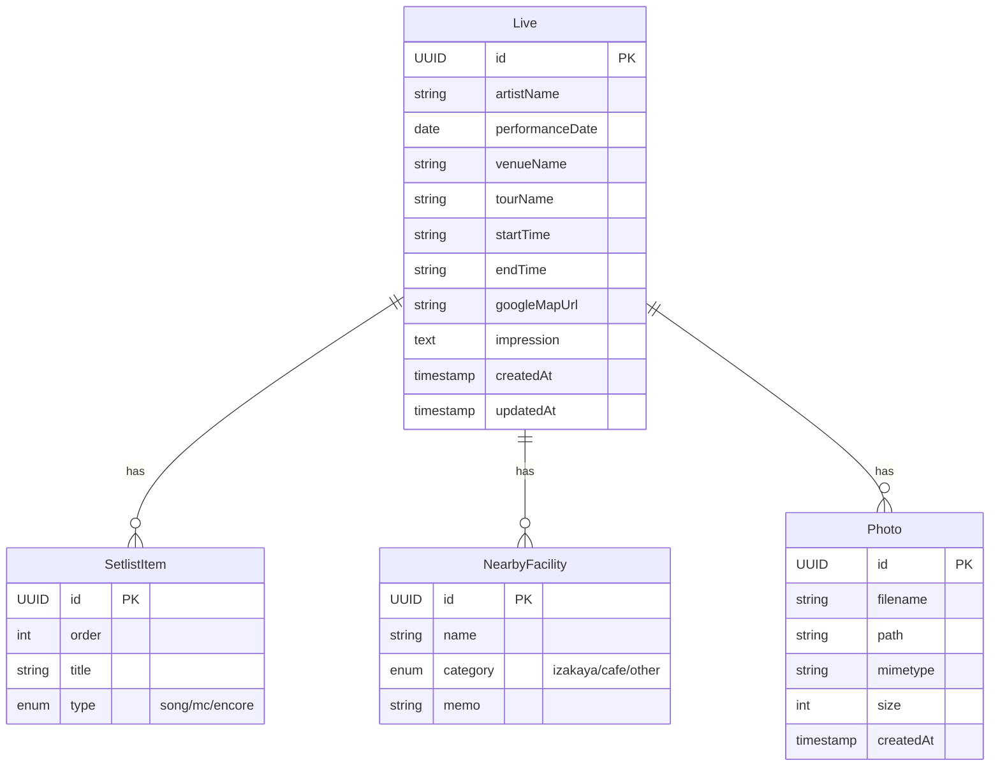

#AI #Claude #report

## livekun 現行仕様まとめ

### 概要

ライブ参戦記録アプリ「ライブくん」。ライブ・コンサートの参戦記録を管理するWebアプリケーション。

### 技術スタック

| レイヤー | 技術 | バージョン |
|---------|------|-----------|
| フロントエンド | Next.js (App Router) | 16.1.6 |
| UIライブラリ | React | 19.2.3 |
| スタイリング | Tailwind CSS | 4 |
| バックエンド | NestJS | 11.0.1 |
| ORM | TypeORM | 0.3.28 |
| データベース | PostgreSQL | 16 |
| 言語 | TypeScript | 5.x |
| インフラ | AWS CDK | - |
| コンテナ | Docker (node:20-alpine) | - |

### 画面一覧

| 画面 | パス | 機能 |
|------|------|------|
| ホーム | `/` | 参戦記録一覧（カード形式、日付降順） |
| 新規作成 | `/lives/new` | ライブ記録の新規作成フォーム |
| 詳細 | `/lives/[id]` | 記録の詳細表示・削除 |

### データモデル

### API一覧

| メソッド | エンドポイント | 説明 |
|---------|--------------|------|
| GET | `/api/lives` | 全ライブ取得（日付降順） |
| GET | `/api/lives/:id` | 特定ライブ取得 |
| POST | `/api/lives` | ライブ作成 |
| PUT | `/api/lives/:id` | ライブ更新 |
| DELETE | `/api/lives/:id` | ライブ削除 |
| POST | `/api/lives/:id/photos` | 写真アップロード（最大100枚、100MB/枚） |

### 現在の状態管理

- フロントエンド: **localStorage** のみ（バックエンドAPI未連携）
- 状態管理ライブラリ: 未使用（React useState のみ）
- コンポーネント分割: 未実施（`src/components/` は空）

### インフラ構成

- ローカル: docker-compose で PostgreSQL コンテナ起動
- デプロイ: AWS CDK（ap-northeast-1）
- Dockerfile: フロントエンド・バックエンド共にマルチステージビルド

### 認証・セキュリティ

- 認証: **未実装**
- CORS: 全オリジン許可
- バリデーション: NestJS ValidationPipe + class-validator
